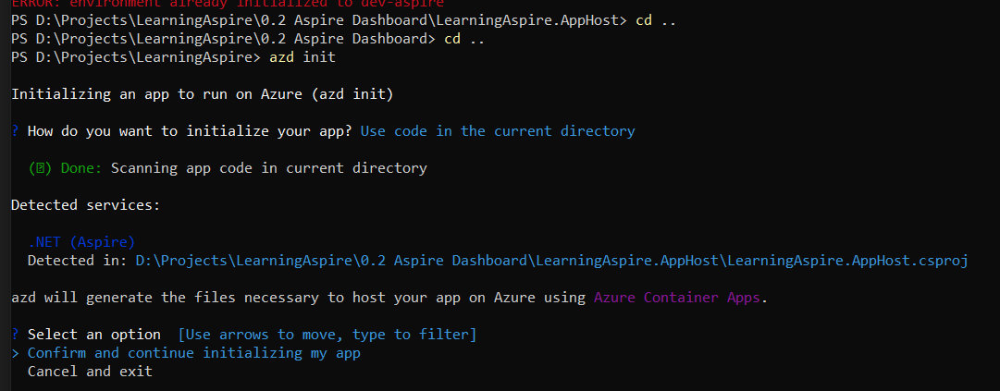
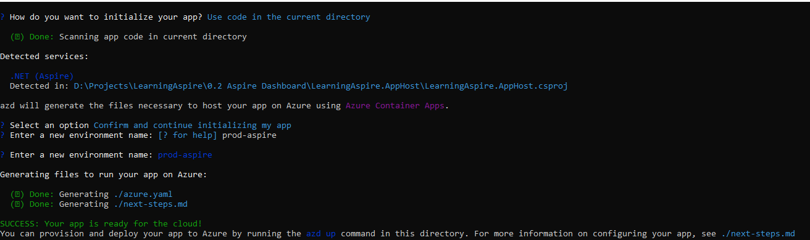
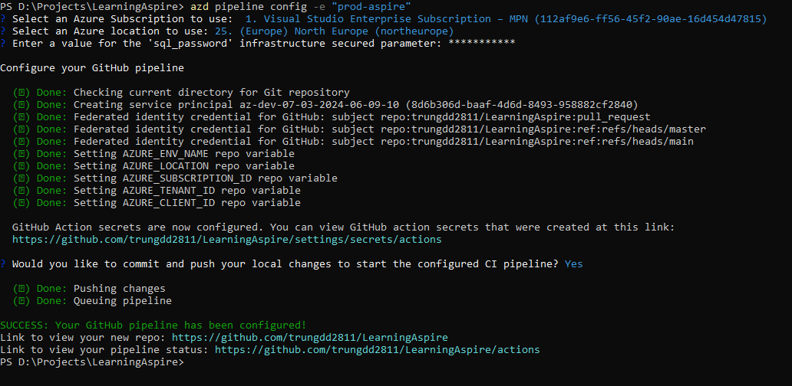
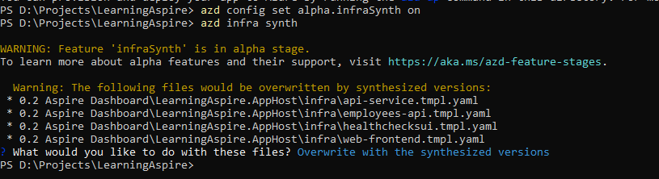

# Lessons learned from using Azure Developer CLI and Github Actions

Please read the link below to understant the basic steps first
* https://learn.microsoft.com/en-us/dotnet/aspire/deployment/azure/aca-deployment-github-actions?tabs=windows&pivots=github-actions

1 - Using azd to initialize the deployment template

2 - Add the Github Actions workflow file: please read the link below, section "Add the GitHubu Actions ..."
* https://learn.microsoft.com/en-us/dotnet/aspire/deployment/azure/aca-deployment-github-actions?tabs=windows&pivots=github-actions

3 - Run the azd pipeline config command to configure your deployment pipeline and securely connect it to Azure:

4 - Push the changes to correct branch as mentioned in Github Action workflow file and trigger the deployment

5 - (Optional) To see generated bicep files, please see the image below
