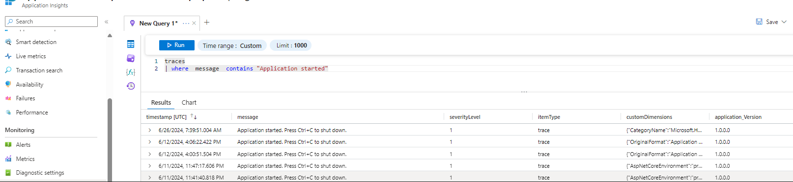
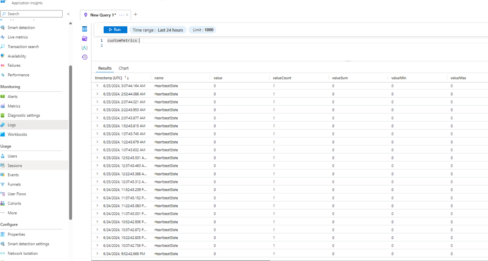
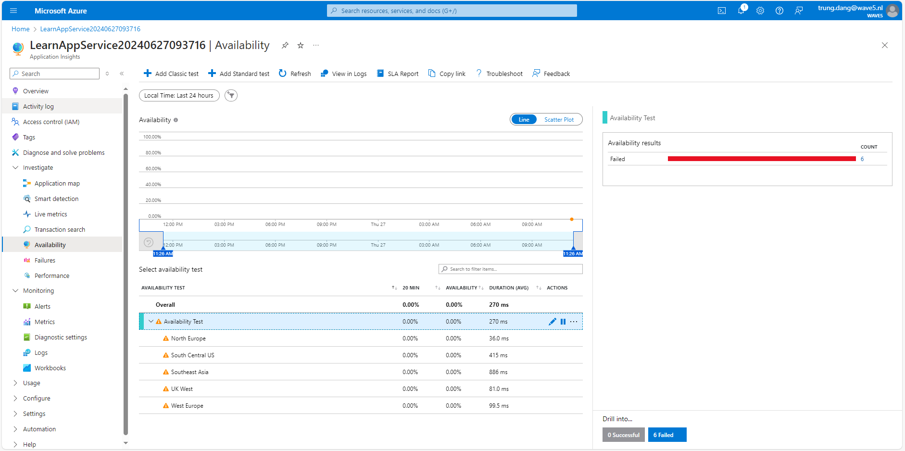
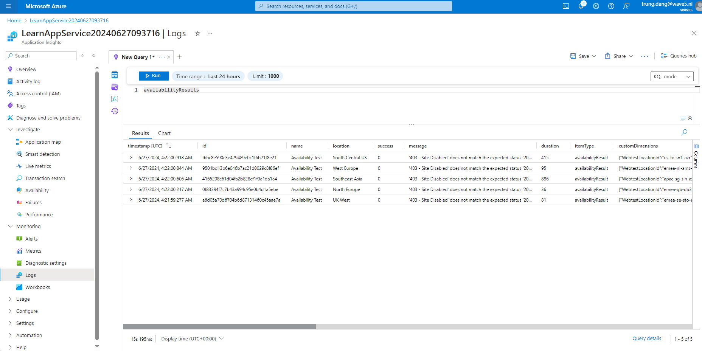

# Lessons learned when using Application Insights

## Enabling Application Insights in Azure
There are 2 ways to enable Application Insights in Azure:
1. **Enable Application Insights during the creation of the Azure Web App (deployed in Azure App Service)**:
	* You don't have write additional code to enable Application Insights. It's automatically configured when you create the Web App.
	* When you create a new Azure Web App, you can enable Application Insights directly from the Azure Portal. This will automatically configure the Web App to send telemetry data to Application Insights.
	* This is the easiest way to enable Application Insights, especially if you are creating a new Web App.
	* You can also enable Application Insights for an existing Web App by going to the "Application Insights" section in the Web App settings and clicking "Enable".

2. **Write code to enable Application Insights in your application**:
	* If you are not using Azure Web Apps or want more control over how telemetry data is collected, you can write code to enable Application Insights in your application.
	* You can use the Application Insights SDK to manually instrument your application and send telemetry data to Application Insights.
	* This gives you more control over what telemetry data is collected and how it is sent to Application Insights.
	* You can also use the Application Insights SDK to add custom telemetry data to your application.
	* This method is more flexible but requires more work to set up and configure.

## Using table "traces" to track if the application is started/restarted or not

## Using Heartbeat data to check if the application is running or not
Heartbeat data is collected automatically by the Application Insights SDK to check if the application is running or not. 
If the application is running, the heartbeat data is sent to Application Insights at regular intervals (default is 15 minutes). 
If the application stops running, the heartbeat data stops being sent, and you can use this information to track the availability of your application.

## Using Availability Tests to monitor the availability (is alived) of your application from different locations/regions

