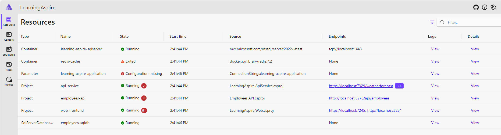
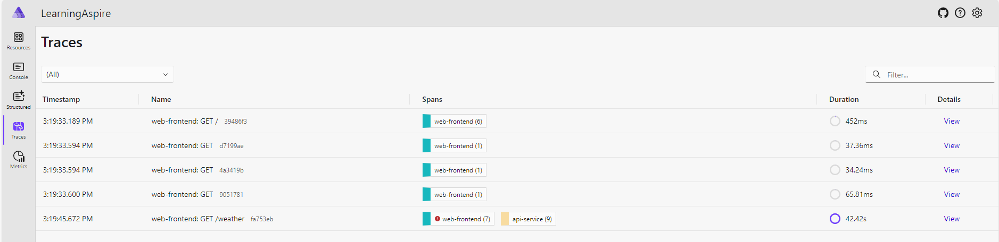
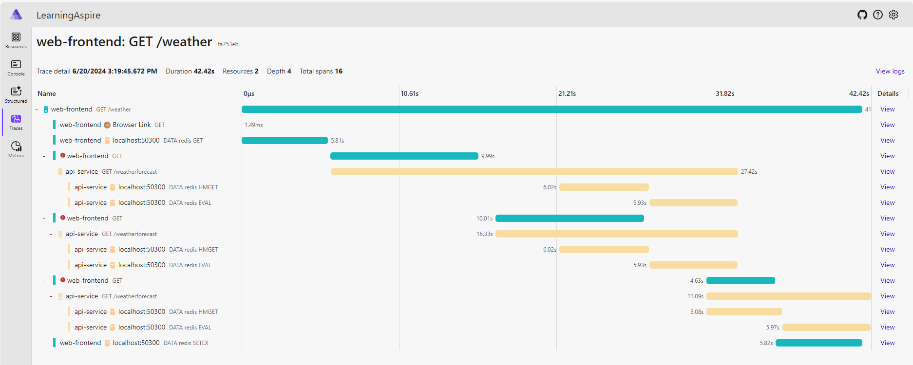
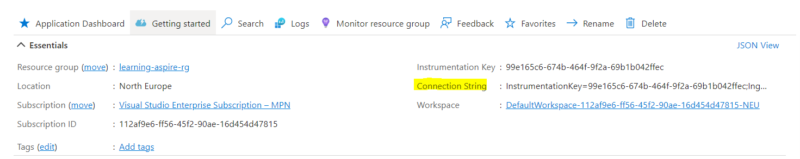
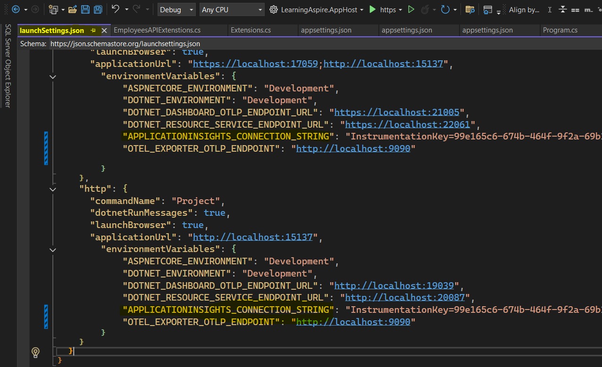
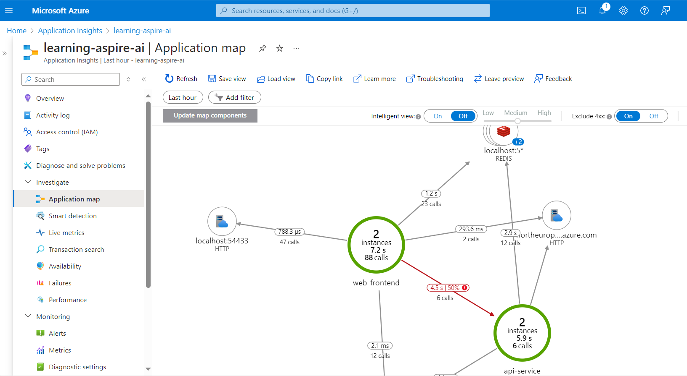
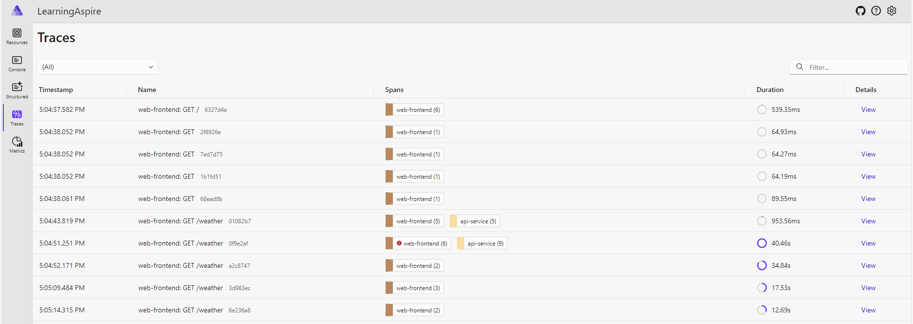
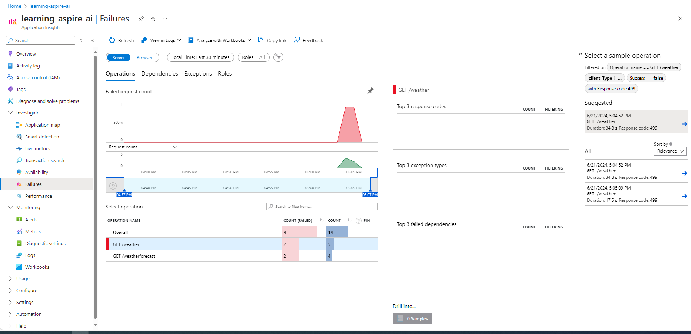
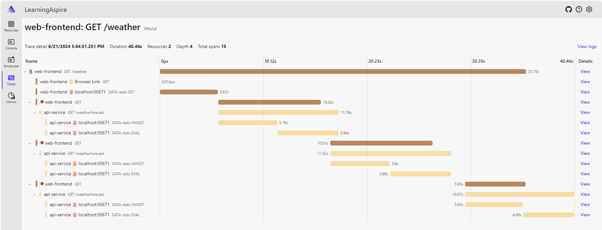
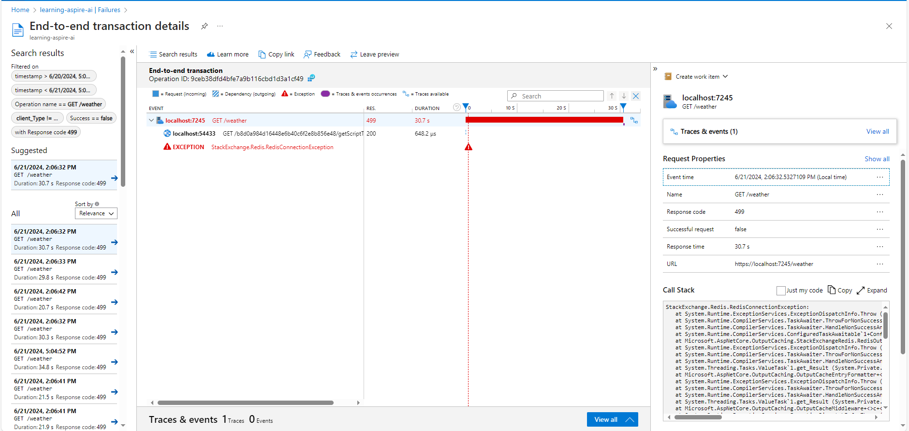

# Lessons learned when using Open Telemetry 

OpenTelemetry is a powerful observability framework for cloud-native software. 
It provides a set of APIs, libraries, agents, and instrumentation to collect distributed traces, metrics, and logs from your applications. 
Aspire provides a very useful built-in dashboard to visualize the data collected by OpenTelemetry.







## Aspire Dashboard

* Can be used as standalone mode via using specific docker image. The dashboard also has functionality for viewing .NET Aspire resources. 
The dashboard resource features are disabled when it is run in standalone mode
* The dashboard is designed as a development and short-term diagnostic tool. 
The dashboard persists telemetry in-memory which creates some limitations:
	* Telemetry is automatically removed if telemetry limits are exceeded.
	* **No telemetry is persisted when the dashboard is restarted.**


## How to send OpenTelemetry data to Azure Monitor - Application Insights
1. Create an Azure Application Insights resource in Azure Portal. Then get the connection string

2. Add the following code to your application to send OpenTelemetry data to Azure Monitor - Application Insights
	```csharp
	// Uncomment the following lines to enable the Azure Monitor exporter (requires the Azure.Monitor.OpenTelemetry.AspNetCore package)

	if (!string.IsNullOrEmpty(builder.Configuration["APPLICATIONINSIGHTS_CONNECTION_STRING"]))
	{
		builder.Services.AddOpenTelemetry()
			.UseAzureMonitor(opts =>
			{
				opts.EnableLiveMetrics = true;
			});
	}
	'''
3. Update the connection string to environment variables. In visual studio, you can see the following image to update the environment variables


4. Run the application and check the data in Azure Monitor - Application Insights


## Comparison between Azure Application Insights and Azure Aspire Dashboard

1. Dashboard
	* Aspire Dashboard: Built-in dashboard to visualize the data collected by OpenTelemetry
	
	* Azure Application Insights: Customizable dashboard to visualize the data collected by OpenTelemetry
	

2. Failure visualization
	* Aspire Dashboard: 
	
	* Azure Application Insights:
	