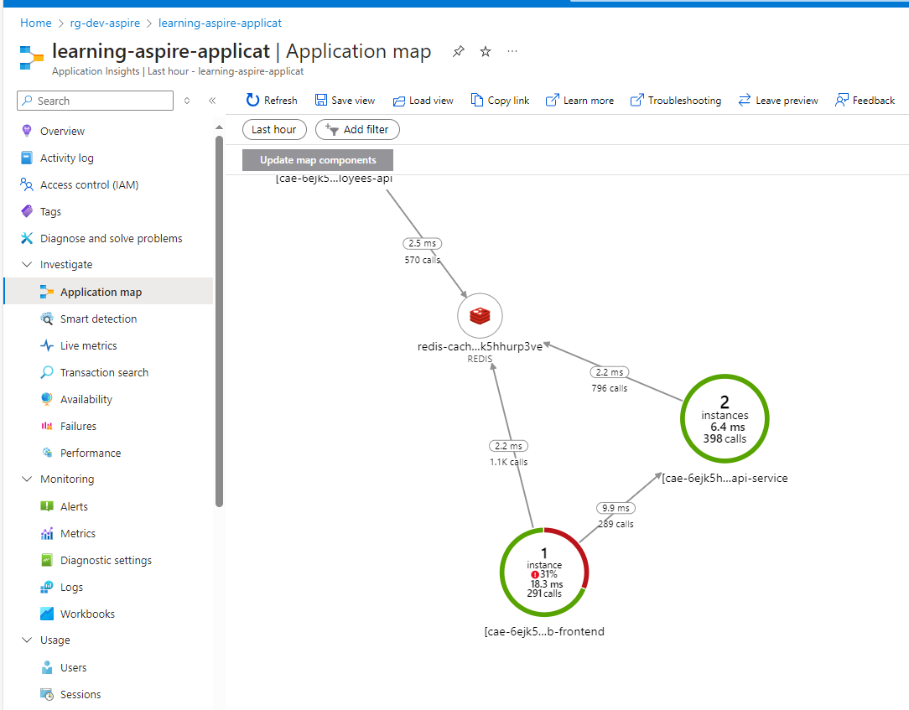

# Lessons learned when using Health Checks - UI

* It is an "open source" dashboard. Please see the details here: https://github.com/Xabaril/AspNetCore.Diagnostics.HealthChecks
* For Aspire projects, the implementation is different so please view the example project below: 
	* https://github.com/dotnet/aspire-samples/tree/main/samples/HealthChecksUI

## 1 - The SSL connection could not be established
```csharp

if (!app.Environment.IsDevelopment())
{
	app.UseExceptionHandler("/Error", createScopeForErrors: true);
	// The default HSTS value is 30 days. You may want to change this for production scenarios, see https://aka.ms/aspnetcore-hsts.
	app.UseHsts();
	app.UseHttpsRedirection(); => move it here
}
//we should apply this policy for production environment only to avoid the error "The SSL connection could not be established"
//app.UseHttpsRedirection();

```


## 2 - Automatically adding health-checks for the dependent components
When integrating this health-checks dashboard with aspire projects, it added necessary health-checks for 
the dependent components automatically


```csharp
var services = builder.Services;

// disable these codes and the health-checks dashboard will remove the related checks on UI too
//builder.AddRedisDistributedCache(Constants.RedisCache);
//builder.AddRedisOutputCache(Constants.RedisCache);

builder.AddSqlServerDbContext<EmployeeDbContext>(Constants.EmployeesDB,
sqlEFCoreOpts =>
{
	//get connection string from appsettings.json
	//sqlEFCoreOpts.ConnectionString = @"Data Source=IDL-LT-127\SQLEXPRESS;Database=employees-sqldb;Integrated Security=True;Connect Timeout=30;Encrypt=True;Trust Server Certificate=True;Application Intent=ReadWrite;Multi Subnet Failover=False";
	sqlEFCoreOpts.DisableRetry = true;
},
dbContextOpts =>
{
	//dbContextOpts.UseModel(Infrastructure.CompiledModels.EmployeeDbContextModel.Instance);
	dbContextOpts.EnableSensitiveDataLogging();
	dbContextOpts.EnableDetailedErrors();
	dbContextOpts.LogTo(Console.WriteLine); // Log to console
});
```


## 3 - The dashboard is very helpful if we have some services cannot be accessed from internet

In the situation below, we have 2 APIs cannot be accessed from the internet so we cannot know if they are running or not.
By using this open-source project, it provides a dashboard and also an alerts system for us. It will reduce our work on Azure


On Azure, we have to check manually as below





