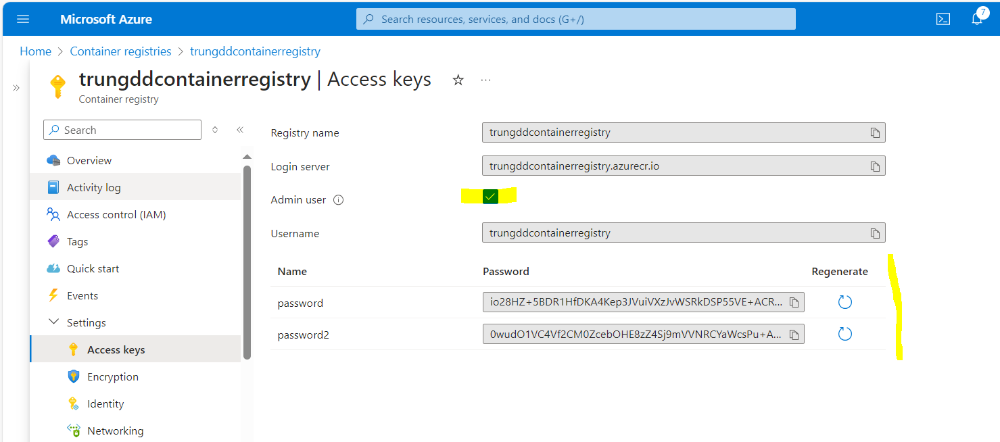
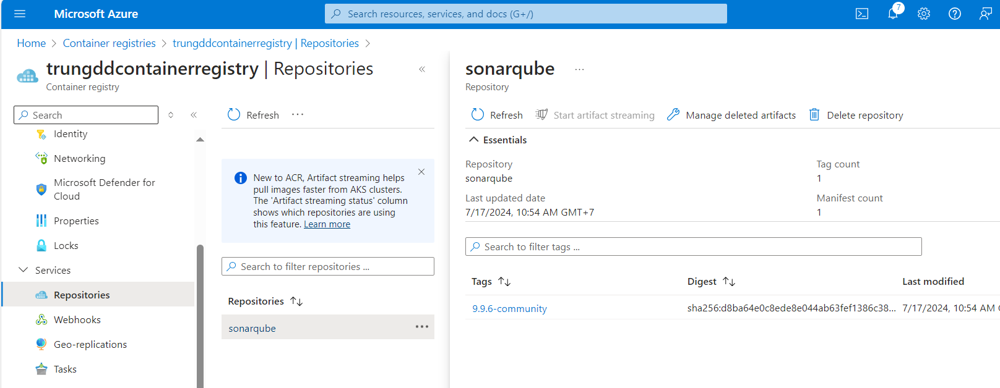
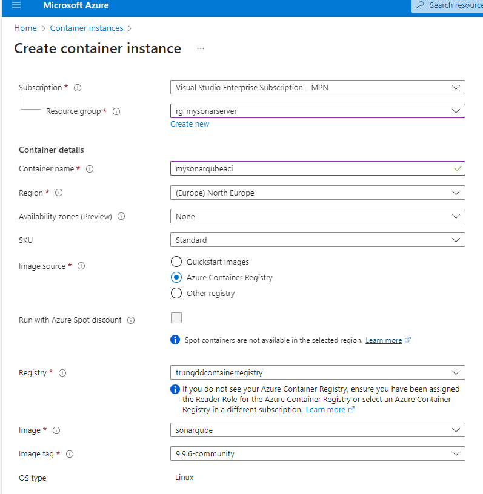
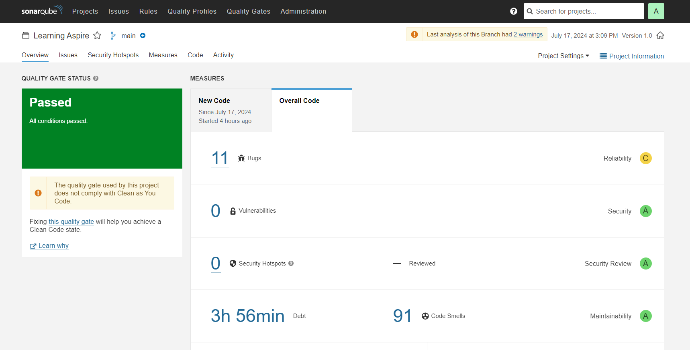
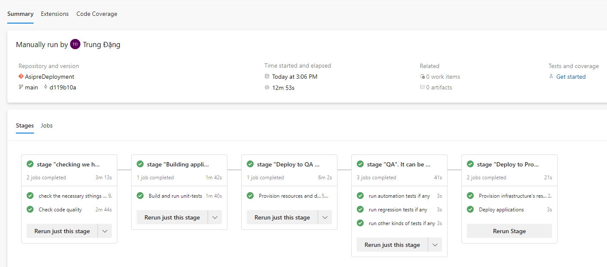
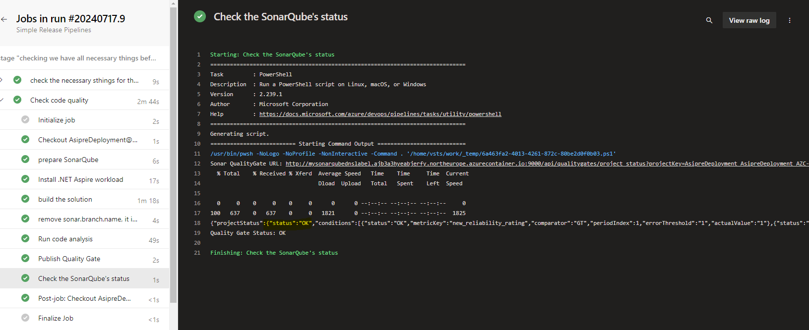
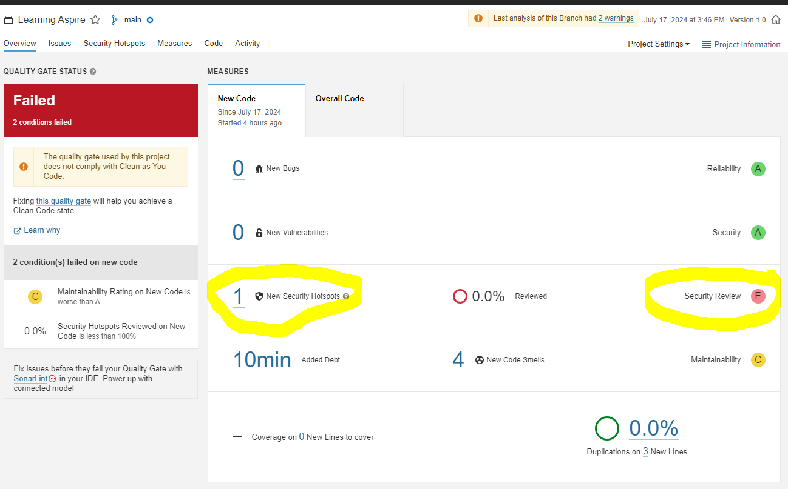
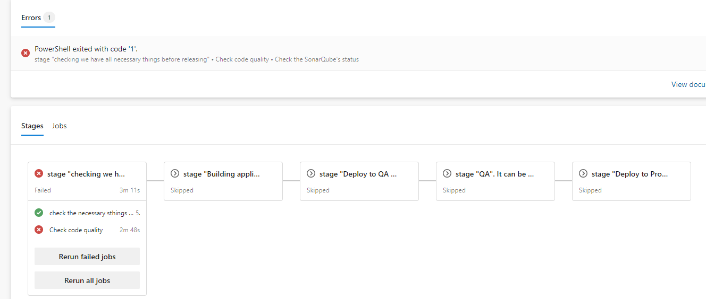
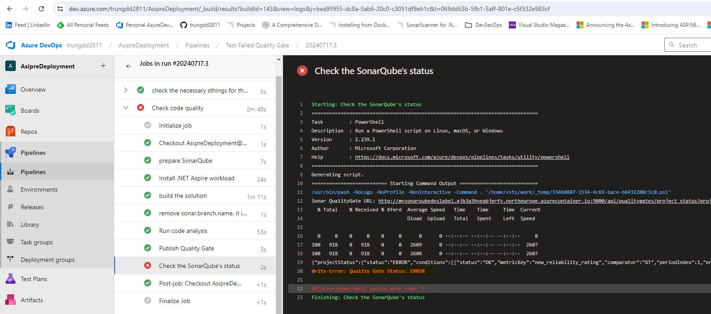

# Lessons learned from integrating SonarQube to Azure Pipelines

The integration inludes the basic steps below:
* Deploying a SonarQube server to Azure
* Setup the necessary connection between the installed SonarQube and Azure Pipelines
* Setup a QualityGate in SonarQube, use this gate for the project
* Change the Azure Pipline to add steps to scan codebase and check the analysis's status. Stop the pipeline if
  the stauts is ERROR

Please see the link below for more information: https://azuredevopslabs.com/labs/vstsextend/sonarqube/

## 1. Deploying a SonarQube server to Azure
### 1.1  Create a new Azure Container Registry to store the Sonarqube image
Because Docker Hub now applies "Download rate limit" policy so we should create our own Azure Container Registry
to store the necessary images (https://docs.docker.com/docker-hub/download-rate-limit/)



### 1.2  Uploading SonarQube image to the created Azure Container Registry

Following the instructions in the link:  https://learn.microsoft.com/en-us/azure/container-registry/container-registry-get-started-docker-cli?tabs=azure-cli

```powershell
#login to your azure subscription
az login

#login to your azure container registry
docker logintrungddcontainerregistry.azurecr.io

#pull sonarqube image
docker pull sonarqube:9.9.6-community

#tag this image
docker tag sonarqube:9.9.6-community trungddcontainerregistry.azurecr.io/sonarqube:9.9.6-community

#push this image to your azure container registry
docker push trungddcontainerregistry.azurecr.io/sonarqube:9.9.6-community
```



### 1.3 Deploying the image to Azure Container Instance



## 2 Setup the necessary connection between the installed SonarQube and Azure Pipelines
Please following the link below to do it: https://azuredevopslabs.com/labs/vstsextend/sonarqube/

## 3 Setup a QualityGate in SonarQube, use this gate for the project
Please following the link below to do it: https://azuredevopslabs.com/labs/vstsextend/sonarqube/

## 4 Change the Azure Pipline to add steps to scan codebase and check the analysis's status. 

Using the code below to create necessary steps to scan codebased and stop the pipeline if status of the analysis is ERROR (did not pass QualityGate of SonarQube)

```yaml
steps:
    - pwsh: |
         $qualityGateURL = "$(SONARQUBE_HOST_VAR)/api/qualitygates/project_status?projectKey=$(SONARQUBE_PROJECT_KEY)"
         Write-Host "Sonar QualityGate URL: $qualityGateURL"
         curl -u $(SONARQUBE_TOKEN_VAR): -G --data-urlencode --data-urlencode $qualityGateURL > result.json
         $jsonContent = Get-Content result.json -Raw
         Write-Host $jsonContent
         $parseObject = $jsonContent | ConvertFrom-Json
         $status = $parseObject.projectStatus.status
         if ($status -eq "ERROR"){
             Write-Error "Quality Gate Status: $status"
         }

         Write-Host "Quality Gate Status: $status"
      displayName: Check the SonarQube's status
```


# The results

* Passed:




* Failed:




