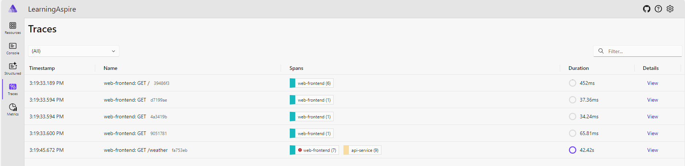
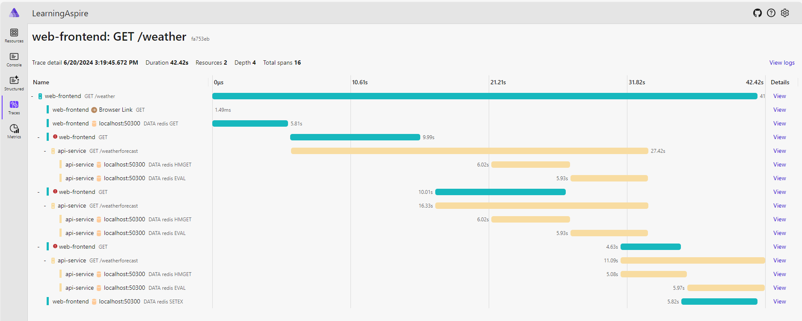

# Lessons learned when using Open Telemetry 

OpenTelemetry is a powerful observability framework for cloud-native software. 
It provides a set of APIs, libraries, agents, and instrumentation to collect distributed traces, metrics, and logs from your applications. 
Aspire provides a very useful built-in dashboard to visualize the data collected by OpenTelemetry.

